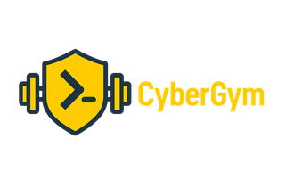

#  CyberGym

CyberGym is a modern, deliberately insecure web application built for hands-on security training and
Capture-the-Flag practice. It packs vulnerabilities from the entire
[OWASP Top Ten](https://owasp.org/www-project-top-ten) along with many other security flaws found in
real-world applications — ideal for security trainings, awareness demos, CTFs and as a guinea pig for
security tools.

> CyberGym is a re-branded derivative of [OWASP Juice Shop](https://owasp.org/www-project-juice-shop/).
> See [Licensing](#licensing) for full attribution.

## Table of contents

- [Setup](#setup)
    - [From Sources](#from-sources)
    - [Docker Container](#docker-container)
- [Documentation](#documentation)
    - [Node.js version compatibility](#nodejs-version-compatibility)
    - [Companion guide](#companion-guide)
- [Contributing](#contributing)
- [Licensing](#licensing)

## Setup

### From Sources

1. Install [node.js](#nodejs-version-compatibility)
2. Run `git clone https://bitbucket.org/whl-static/cybergym.git --depth 1` (or
   clone your own fork of the repository)
3. Go into the cloned folder with `cd cybergym`
4. Run `npm install` (only has to be done before first start or when you change the source code)
5. Run `npm start`
6. Browse to <http://localhost:3000>

### Docker Container

1. Install [Docker](https://www.docker.com)
2. Run `docker build -t cybergym .` from the cloned repository folder
3. Run `docker run --rm -p 127.0.0.1:3000:3000 cybergym`
4. Browse to <http://localhost:3000>

## Documentation

### Node.js version compatibility

CyberGym officially supports the following versions of [node.js](http://nodejs.org) in line with the
official [node.js LTS schedule](https://github.com/nodejs/LTS) as close as possible:

| node.js | Supported              | Tested             |
|:--------|:-----------------------|:-------------------|
| 25.x    | :x:                    | :x:                |
| 24.x    | :heavy_check_mark:     | :heavy_check_mark: |
| 23.x    | ( :heavy_check_mark: ) | :x:                |
| 22.x    | :heavy_check_mark:     | :heavy_check_mark: |
| 21.x    | ( :heavy_check_mark: ) | :x:                |
| 20.x    | :heavy_check_mark:     | :heavy_check_mark: |
| <20.x   | :x:                    | :x:                |

CyberGym is automatically tested _only on the latest `.x` minor version_ of each node.js version
mentioned above! There is no guarantee that older minor node.js releases will always work. Please make
sure you stay up to date with your chosen version.

### Companion guide

Because CyberGym is a fork of OWASP Juice Shop, the upstream
[_Pwning OWASP Juice Shop_](https://pwning.owasp-juice.shop) companion guide remains an excellent
reference. It gives a complete overview of the vulnerabilities found in the application, including hints
on how to spot and exploit them, plus step-by-step solutions to every challenge. Note that some
branding, naming and URLs in that guide differ from this CyberGym build.

## Contributing

Contributions are welcome! Please check [CONTRIBUTING.md](CONTRIBUTING.md) to learn how to contribute to
the codebase. When using an AI assistant, also review the guidelines in
[.claude/CLAUDE.md](.claude/CLAUDE.md).

## Licensing

This program is free software: you can redistribute it and/or modify it under the terms of the
[MIT license](LICENSE).

CyberGym is a re-branded derivative of OWASP Juice Shop. CyberGym modifications and branding are
Copyright © 2026 HackerGPT. OWASP Juice Shop and any contributions are Copyright © 2014-2026 by Bjoern
Kimminich & the OWASP Juice Shop contributors. The original copyright notice is retained as required by
the MIT license. See the [NOTICE](NOTICE) file for full attribution.

</content>
</invoke>
